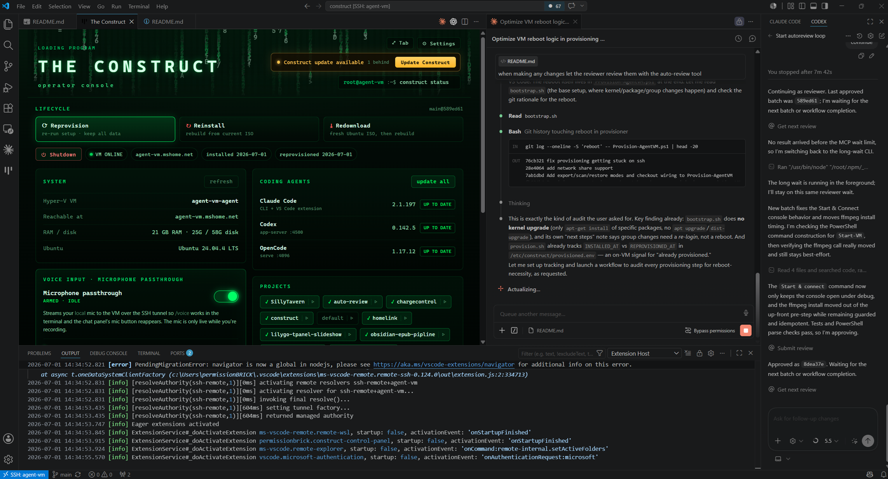

<div align="center">


### *"This… is the Construct. Our loading program. We can load anything."*

**A disposable, sandboxed Ubuntu VM for unattended AI coding agents — Claude Code, Codex,
even Opencode. Bypass mode, root access, anything we need. Isolated inside Hyper-V, at
minimal risk to your host PC.**

[](LICENSE.md)
[](docs/installation.md)
[](docs/installation.md)
[](https://github.com/permissionBRICK/The-Construct/pulls)

[Install](#-load-the-construct) · [Features](#-features) · [Connect](#-jack-in) ·
[Configuration](#%EF%B8%8F-configuration) · [Documentation](#-documentation)

</div>

---

## ⚡ Load the Construct

Open **PowerShell** on Windows and paste:

```powershell
irm https://raw.githubusercontent.com/permissionBRICK/The-Construct/main/install.ps1 | iex
```

One command, zero VM interaction: it elevates to Administrator, builds an Ubuntu autoinstall
ISO, creates a Hyper-V VM, installs Ubuntu unattended, provisions the full agent stack, and
wires up your host's SSH + VS Code config. Answer a few questions up front (RAM, disk,
projects) — then just hit connect.

> **Requirements:** Windows 10/11 with Hyper-V, and WSL with a Linux distro for the ISO
> build (`wsl --install -d Ubuntu` if missing). Installs from `permissionBRICK/The-Construct`;
> pass `-Repo owner/name` for a fork. Already have a VM? The installer offers
> **reprovision**, **reinstall** (with [config save & restore](docs/backup-restore.md)), and
> **export config**. Other paths — bundled ISO, BYO VM, no-admin — are in the
> [installation guide](docs/installation.md).

<div align="center">



<sub>*The operator console: lifecycle, live agent versions, mic passthrough, and project profiles on one screen.*</sub>

</div>

## ✨ Features

- 🤖 **Agents preinstalled, zero config** — Claude Code, Codex, and Opencode CLIs installed
  and configured for **unattended bypass mode**: no permission prompts, running as root,
  flagged as a sandbox (`IS_SANDBOX=1`).
- 🔒 **Sandboxed by design** — everything runs inside a throwaway Hyper-V VM. Agents get a real root shell; your host PC stays out of reach.
- 🎤 **Microphone passthrough** — makes Voice-Input work seamlessly in the VSCode Claude Code extension, even over a Remote-SSH connection.
- ♻️ **Disposable, but almost persistent** — reinstalls can save and auto-restore your agent config, you won't even notice you just formatted your entire VM:
  instruction files, memory, skills, subscription auth, git/GitHub credentials, MCP logins.
- 🎛️ **One-screen control panel** — a VS Code extension (installed on your host by the
  script) that operates the VM from a single panel: lifecycle (reprovision / reinstall / redownload / export), **project profiles** (import / select / edit), and much more.
- 🖥️ **Connect your way** — VS Code Remote-SSH, browser VS Code, vscode.dev tunnels, Codex
  App, Opencode serve, or plain SSH. All wired up automatically.
- 🗂️ **Repos as a Windows drive** — provisioning stands up an SMB share of the repos folder
  and auto-mounts it on your host (`net use … /savecred /persistent:yes`). Credentials are
  generated once and reused on every reprovision; the host edits files as **root**, the same
  identity the agents use.
- 📦 **Project profiles** — declare repos, SDKs (`node`, `python`, `dotnet`), MCP servers,
  and setup commands in a JSON file; provisioning checks out and builds everything.
- 🔌 **MCP servers everywhere** — declare a server once and it's written into Claude Code,
  Codex, and Opencode configs alike, stdio or HTTP.
- ✍️ **Your commits, your name** — AI attribution trailers are turned off by default.
- 🚀 **Fast reconnects** — the VS Code server and agent extensions are pre-seeded, so even
  the first Remote-SSH connect skips the usual download wait.

## 🔌 Jack in

After install, every connection target is ready — the VM is reachable as
`agent-vm.mshome.net` (alias `agent-vm`):

| Client | How | Notes |
|--------|-----|-------|
| **VS Code Remote-SSH** | Remote Explorer → `agent-vm` | Host entry, key, and platform pre-configured; Claude Code extension starts in bypass mode |
| **VS Code in the browser** | `http://agent-vm.mshome.net:8000/?tkn=<token>` | On by default via `code serve-web`; token-gated |
| **vscode.dev tunnel** | `https://vscode.dev/tunnel/<name>` | Opt-in (`VSCODE_TUNNEL=true`); no inbound port needed |
| **Codex App** | Add `agent-vm` as an SSH host | Root key authorized during provisioning |
| **Opencode** | `agent-vm.mshome.net:4096` | `opencode serve` autostarts as a service |
| **Windows file share** | `Z:` → `\\agent-vm.mshome.net\repo` | SMB share of the repos folder, auto-mounted on the host with saved credentials; opens as root |
| **Terminal** | `ssh agent-vm` | Direct root access |

Details in [Remote access & services](docs/remote-access.md).

## ⚙️ Configuration

Host-local settings live on the VM at `/etc/construct/config.env`:

```env
AGENT_NAME=agent-vm-01
PROJECTS=default,your-project
AI_TOOLS=opencode,claude-code,codex
WORKSPACE_ROOT=/root/repos
```

Per-project setup is declared once in `projects/*.json` and reused on every (re)provision:

```jsonc
{
  "name": "customer-portal",
  "repos": [{ "url": "git@github.com:acme/customer-portal.git", "directory": "customer-portal" }],
  "sdks": { "node": "22" },
  "mcp": [{ "name": "context7", "type": "stdio", "command": "npx", "args": ["-y", "@upstash/context7-mcp"] }],
  "provisionCommands": ["npm ci", "cp -n .env.example .env || true"]
}
```

Everything else — env vars, MCP transports, SDK installs, checkout credentials — is in
[Project profiles & configuration](docs/projects.md) and [Provisioning](docs/provisioning.md).

## 📚 Documentation

| Guide | What's inside |
|-------|---------------|
| [Installation](docs/installation.md) | One-liner details, install options A–D, the automated flow, building the autoinstall ISO |
| [Provisioning](docs/provisioning.md) | `Provision-AgentVM.ps1`, the non-interactive `provision.sh` + all env vars, AI tool setup, bypass-mode defaults |
| [Manual setup](docs/manual-setup.md) | Taking a blank Ubuntu VM to ready state by hand — no Windows scripts |
| [Project profiles & configuration](docs/projects.md) | `config.env`, profile schema, MCP servers, provision commands, repo checkout |
| [Remote access & services](docs/remote-access.md) | VS Code server / serve-web / tunnels, Codex remote, service lifecycle, agent runtime |
| [Control panel](docs/control-panel.md) | The VS Code operator console: status, connect/power, lifecycle, updates, projects, usage, mic passthrough |
| [Backup & restore](docs/backup-restore.md) | Saving agent config, auth, and projects across VM reinstalls |

## 🔐 Security model

The Construct trades guardrails for isolation — know what that means:

- **Bypass mode is sandbox-only.** Agents run as root with no permission prompts. That's the
  point of a disposable VM, and a terrible idea anywhere holding real credentials or data.
- **The bootstrap key is burned.** A keypair committed to this repo authorizes first contact
  with a fresh VM; it's removed at the end of provisioning, but anyone with the repo can log
  into an *un-provisioned* VM.
- **Backups hold plaintext secrets.** The git-ignored `.construct-backup/` folder contains
  auth tokens and git credentials — treat it as a secret.
- **`code serve-web` is a root IDE over HTTP.** Token-gated, but keep it on trusted networks
  or bind it to localhost and tunnel in.

## 🧭 Principles

- Keep Ubuntu minimal — use Docker for project-specific tools.
- Keep setup logic in Git — project profiles instead of manual setup notes.
- Avoid global SDK installs unless unavoidable; avoid secrets in VM images.
- Make VMs disposable and setup repeatable.

## 📄 License

[MIT](LICENSE.md) © permissionBRICK

<div align="center">
<sub><i>Unfortunately, no one can be told what the Construct is. You have to <a href="#-load-the-construct">see it for yourself</a>.</i></sub>
</div>
