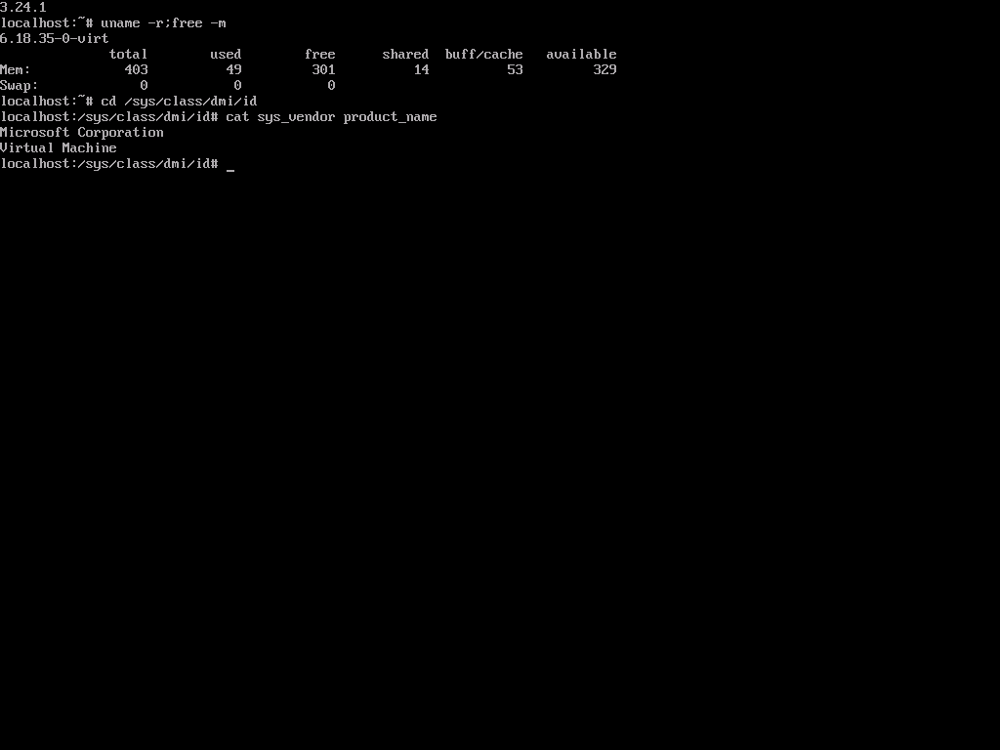

# Alpine child VM field test — 2026-09-10

The delegated primary `haus-vm` created and booted `alpine-smoke` directly on
STANDPC's Hyper-V host. This was a real sibling VM, not nested KVM and not a fake
driver test. Alpine reached a root shell through the host console.

## Corrections

`086b5ca2301e37eadf06a5ad98aa3b5a1a24f768` fixes the actual Hyper-V first-create
failure. `Get-VMKeyProtector` returns a non-enumerated `System.Byte[]` containing
`00 00 00 04` for a fresh, uninitialized protector. Both the original outer-array
count and the first length-only correction treated that as an initialized
protector and refused template configuration. A live probe confirmed Hyper-V
accepts the template change in this state. The shared predicate now recognizes
that exact empty blob, null and an empty array; every other nonempty blob remains
protected. Hardware configuration and capability reporting use the same predicate.

`b2ba1f372e8d6dbf9bf267a1a7a2a6609455a915` also fixes initial media acquisition:
deleting a nonexistent partial file must succeed when its parent directory does
not exist yet. `MediaFileStore` now treats `DirectoryNotFoundException` as absence,
after applying the existing path confinement checks. The regression failed before
the change and passes afterward.

Validation: 148 PowerShell driver checks passed, including the actual four-byte
empty blob, unknown nonempty blobs, TPM initialization and preservation of existing
protectors. Both host-release CI runs passed all 1,243 service tests.

## Live guest evidence

| Item | Verified value |
|---|---|
| ISO | `alpine-virt-3.24.1-x86_64.iso`, 69,206,016 bytes |
| SHA-256 | `e73a6241bd5f3c5c2d4d38c02cc52c378c0415a7c888bd292066bf36e0f41a39` |
| Host media ID | `99b046f98d2171e4aeee1461a201cf3d` |
| Host / parent | STANDPC / `haus-vm` |
| Child / incarnation | `alpine-smoke` / `87047f0f-9d76-48e3-af82-9821f27c47c6` |
| Hardware | Generation 2, 1 vCPU, 512 MiB fixed RAM, 2 GiB dynamic VHDX |
| Firmware | Secure Boot off, TPM off, Linux certificate template |
| Lifetime | Explicit `1h` on creation and start |
| Guest | Alpine 3.24.1, kernel `6.18.35-0-virt` |
| Guest DMI | `Microsoft Corporation` / `Virtual Machine` |

The host downloaded the ISO from the
[official Alpine release directory](https://dl-cdn.alpinelinux.org/alpine/v3.24/releases/x86_64/)
and verified the publisher's checksum. Creation first left the child Off, then
`construct vm start alpine-smoke --lifetime 1h` booted it. The host's own `Get-VM`
confirmed its identity, generation and resources. This verifies live ISO boot,
not installation onto the virtual disk.



Screenshot capture and raw scancode input worked. The WMI `TypeText` path produced
escape sequences in Alpine's text console; use scancodes for this guest until that
input path is corrected. For example, this types `root` and Enter:

```bash
construct vm console alpine-smoke --scancodes 13,93,18,98,18,98,14,94,1c,9c
```

Scancode requests accept at most 64 bytes; split longer text at complete key
sequences, including releasing any modifiers.

## Deployment notes

The first update to `b2ba1f3` rolled back during commit with `updater-step-failed`.
An `install.json` temporary file remained, pointing to atomic replacement as the
failure site. An isolated serialization test and an identical-content replacement
of the live ledger both passed afterward. A fresh staging/apply of the same release
succeeded (`8769f9173fab49099aecdd32bff7746f`). The exact transient cause was not
established; no host security settings were changed.

The native four-byte correction was tested through a temporary, hash-checked driver
replacement. The previous release's exact driver was restored before the final
normal updater run so its rollback ledger remained consistent.

Final update `77588ddade9c4560bdf832828eb62285` installed `086b5ca` and succeeded
at 12:11:46 UTC. The installed driver SHA-256 matches the field-tested file:
`1a9c1043f52a9fdfee7183442832a85ad69064d1bb9578545ee3241e04182bd2`.
Database health was `ok`, schema 700; recovery was clear. The primary VM remained
Running with continuous uptime, and the production settings hash was unchanged.
Rollback backup: `C:\ProgramData\Construct\service\updates\backup-77588ddade9c4560bdf832828eb62285`.

After the final deployment, capability inspection correctly reported
`secureBootTemplateLocked=false`. Graceful shutdown through Hyper-V integration
services succeeded at 12:13:28 UTC and reported the child Off.

Deletion through `construct vm delete alpine-smoke --yes` completed at 12:13:59 UTC
with no retained artifacts. The downloaded ISO remains cached for reuse.
