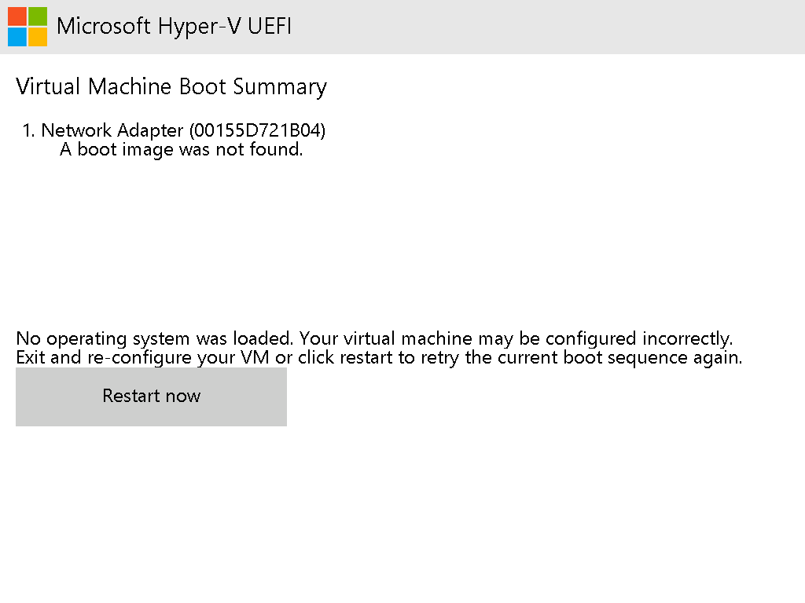
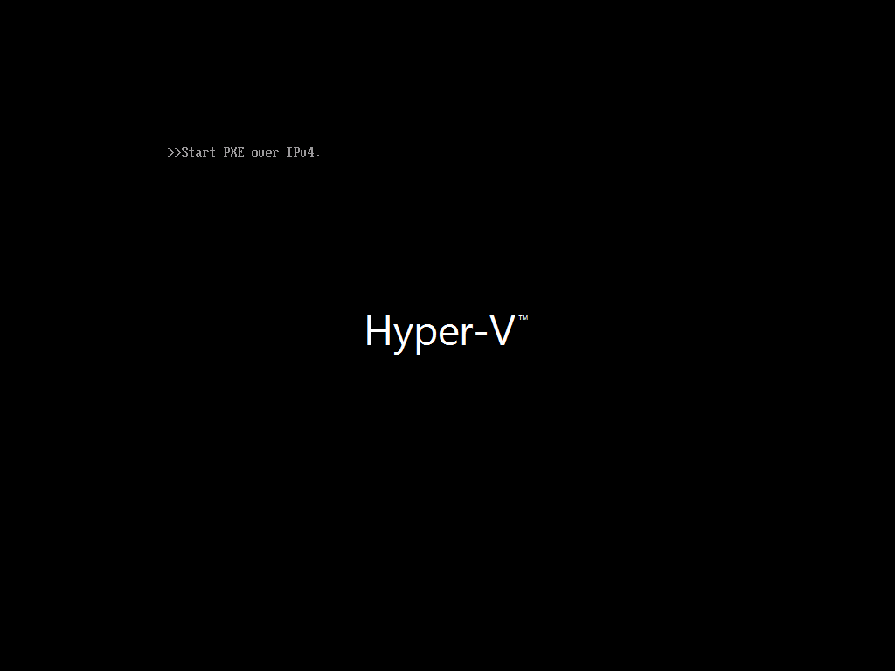

# Hyper-V host-administration feasibility

Status: Phase 0 real-host findings, **not a shipped implementation**. Investigated
2026-09-07 on STANDPC from Linux through the elevated Jarvis relay. Repository base:
`8c02b4777d9fded366b12603bd222db4a3078ada`; investigation branch:
`ha/s0-feasibility`.

The owner's 2026-09-07 decision is screenshot + keyboard + mouse through host-side
Hyper-V WMI (`root\virtualization\v2`). Interactive video through VMConnect/RDP is
unsupported for this delivery. This report establishes backend evidence for
[the requirements](host-administration-and-child-vms.md) and
[implementation Phase 0](host-administration-implementation.md); it does not define
new API contracts. The frozen contracts and an earlier feasibility report did not
exist in this checkout. Existing primary provisioning, local console behavior and
legacy tokens remain the regression boundary.

## Capabilities we can promise

These are backend implementation capabilities, subject to authorization, capacity,
VM state and the service-identity verification still outstanding below. A class
existing in WMI is not evidence that a particular VM can use it.

| Capability | Delivery promise supported by this probe | Limit / observed failure |
|---|---|---|
| Screenshot | Yes: host WMI capture and PNG conversion before any OS; 320×240, 640×480, 1024×768 verified | Native display 1024×768; use bounded dimensions at or below native. Off VM returned 32775. No video/framerate guarantee. |
| Keyboard | Yes: all six requested methods returned 0 without an OS; visible reboot through Ctrl+Alt+Del | Acceptance does not mean text was consumed by firmware. Key layout, OS text entry and Unicode were not validated. |
| Mouse absolute | Expose as conditional, with truthful unavailable results | Synthetic instance exists, but movement and clicking return **32768 (Failed)** at both UEFI and PXE. No preboot pointer promise; OS support untested. |
| Mouse relative | **Unsupported for the tested Gen 2 VM** | No `Msvm_Ps2Mouse` instance. Class/method definitions exist, but neither relative movement nor PS/2 clicking can be invoked for this VM. No Gen 1 test. |
| Interactive console | **Unsupported in this delivery** | VMConnect/RDP 2179 needs a separate authenticated RDP transport/client or gateway; screenshot polling is not that transport. |
| Secure Boot templates | Both `MicrosoftWindows` and `MicrosoftUEFICertificateAuthority`, plus Secure Boot off | Set template **before TPM initialization**. Template setter later fails even after TPM is disabled and even when resubmitting the same template. |
| TPM | Local key protector + virtual TPM enabled successfully; VM started | No Windows install, guest TPM attestation, migration or cross-host key recovery tested. |
| Dual DVD | Two 40 KiB ISO-header fixtures attached simultaneously at SCSI 0:0 and 0:1 | Attachment succeeds; fixtures are intentionally nonbootable and do not prove an installer works. |
| Boot order | DVD A → DVD B → NIC and DVD B → DVD A → NIC both set and read back | Use device objects, not duplicated descriptions. HDD ordering not exercised: probe had no disk. |
| Graceful shutdown | Request only when guest supports it; report failure and retain Running reservation otherwise | No guest integration contact. `Stop-VM -Confirm:$false` prompts internally and fails in NonInteractive mode. Never silently add `-Force`, save, or power off. |
| Save | Both `Stop-VM -Save` and `Save-VM` reached Saved; `Start-VM` resumed | Measured on a mostly empty 512 MiB VM, not representative disk/RAM load. |
| Inventory | Enumerate **all** Hyper-V VMs and VHD capacity/path metadata, including unmanaged VMs | Read-only reconciliation input, not an atomic admission decision; include disk parents, retained files and physical free space separately. |

## Host and probe facts

| Fact | Measured value |
|---|---|
| OS | Microsoft Windows 11 Education **25H2**, `10.0.26200.9168` (`BuildNumber=26200`, `UBR=9168`) |
| Hyper-V | `Microsoft-Hyper-V-All` enabled; module `2.0.0.0`; `vmms.exe` file version `10.0.26100.8875 (WinBuild.160101.0800)` |
| Windows PowerShell | Desktop **5.1.26100.9168**, actual interpreter used for every host probe |
| Relay execution identity | `HOME\permissionBRICK`, elevated administrator, session 3; **not LocalSystem** |
| CPU / visible RAM | 8 logical CPUs; `TotalVisibleMemorySize=33,512,328 KiB` |
| Initial free RAM | `FreePhysicalMemory=5,903,652 KiB`; immediately before first start: **5,932,613,632 bytes** |
| C: free / size | **34,824,765,440 / 998,599,536,640 bytes** at initial probe |
| Existing VM | Only `haus-vm`, Running, Gen 2, 8 vCPU, 16 GiB fixed RAM; read-only inventory only |
| Probe | `hostadmin-probe-a`, ID `07e355e2-82ee-4e61-82c8-9654b0c77614`, Gen 2, **512 MiB fixed RAM**, Default Switch, initially 1 vCPU, no disk/ISO |
| VM default path | `C:\ProgramData\Microsoft\Windows\Hyper-V` |
| VHD default path | `C:\ProgramData\Microsoft\Windows\Virtual Hard Disks` |

The host differs from the brief's 24H2 / about 23 GB free snapshot; measurements
above are authoritative for this experiment, not ongoing capacity promises.
All starts/resumes checked `Win32_OperatingSystem.FreePhysicalMemory` and refused
if subtracting 512 MiB would leave less than 2 GiB. Dynamic-memory maximum was
never above 512 MiB. No VHD was actually created. Automatic checkpoints were
turned off **only on the probe**.

### Reproducible creation and WMI lookup (Windows PowerShell 5.1)

All mutation examples below name only the disposable probe. Run creation once;
subsequent blocks assume that same VM. Refuse a pre-existing probe name or temp
directory instead of adopting someone else's resources.

```powershell
$ErrorActionPreference = 'Stop'
$name = 'hostadmin-probe-a'
if (Get-VM -Name $name -ErrorAction SilentlyContinue) { throw 'Probe already exists' }
if (Test-Path 'C:\Temp\hostadmin-probe') { throw 'Probe directory already exists' }
New-Item -ItemType Directory -Path 'C:\Temp\hostadmin-probe' | Out-Null
$vm = New-VM -Name $name -Generation 2 -MemoryStartupBytes 512MB `
    -NoVHD -SwitchName 'Default Switch'
Set-VMMemory -VM $vm -DynamicMemoryEnabled $false
Set-VM -VM $vm -AutomaticCheckpointsEnabled $false
$free = [int64](Get-CimInstance Win32_OperatingSystem).FreePhysicalMemory * 1KB
if ($free - 512MB -lt 2GB) { throw 'Insufficient free RAM' }
Start-VM -VM $vm

$ns = 'root\virtualization\v2'
$id = $vm.Id.ToString() # Use the authorized VM's immutable ID, not a global first device.
$cs = Get-WmiObject -Namespace $ns -Class Msvm_ComputerSystem -Filter "Name='$id'"
$settings = @($cs.GetRelated('Msvm_VirtualSystemSettingData') |
    Where-Object { $_.VirtualSystemType -eq 'Microsoft:Hyper-V:System:Realized' })[0]
$svc = Get-WmiObject -Namespace $ns -Class Msvm_VirtualSystemManagementService
$video = @($cs.GetRelated('Msvm_VideoHead'))[0]
$keyboard = @($cs.GetRelated('Msvm_Keyboard'))[0]
$mouse = @($cs.GetRelated('Msvm_SyntheticMouse'))[0]
$ps2 = @($cs.GetRelated('Msvm_Ps2Mouse'))
```

`TargetSystem` for thumbnail capture is the **realized settings object's path**,
not the `Msvm_ComputerSystem` path. Production code must validate lookup counts,
refresh after lifecycle transitions and map missing devices to unavailable. The
probe had one video head, one keyboard, one synthetic mouse, zero PS/2 mice;
filtering `Msvm_Ps2Mouse` by `SystemName='$id'` independently also returned zero.
This prevents accidental input to `haus-vm` or another tenant's VM.

## Screenshots: format, dimensions and timings

The video head reported `CurrentHorizontalResolution=1024`,
`CurrentVerticalResolution=768`, `CurrentBitsPerPixel=32`. The thumbnail is instead
RGB565, consistent with the [Microsoft method documentation](https://learn.microsoft.com/en-us/windows/win32/hyperv_v2/getvirtualsystemthumbnailimage-msvm-virtualsystemmanagementservice).
**On this host** the byte array starts with a four-byte **big-endian total array
length**, followed by packed, top-down, little-endian RGB565 pixels. Validate this
layout rather than assuming the full array is pixel data. RGB565 conversion
produced correct colors, orientation and readable firmware text.

| Requested pixels | Return | Buffer bytes | Per-call latency, milliseconds (three sequential samples) |
|---|---:|---:|---|
| 320×240 | 0 | 153,604 | 56.04, 15.74, 17.83 |
| 640×480 | 0 | 614,404 | 30.02, 30.20, 55.89 |
| 1024×768 | 0 | 1,572,868 | 103.19, 109.40, 117.24 |
| Native from video head, also 1024×768 | 0 | 1,572,868 | 104.78, 142.65, 126.46 |
| 1×1 | 0 | 6 | 10.66, 8.39, 8.13 |
| 0×0 | 32775 | 0 | 26.48, 16.57, 16.07 |
| 1920×1080 | 32775 | 0 | 20.02, 8.35, 8.17 |
| 2048×1536 | 32775 | 0 | 9.48, 10.38, 9.06 |
| 4096×3072 | 32775 | 0 | 14.15, 13.20, 13.66 |

Stopwatch surrounds the WMI method call in the already-running PowerShell
process. These values exclude relay transit, process startup, WMI discovery,
PNG conversion and API overhead. A separate native capture took 126.59 ms;
System.Drawing encoding took 79.78 ms and produced a **19,331-byte PNG**.

Boundary probes do **not** establish a simple hard maximum equal to native:
1025×768, 1024×769, 1280×720, 1920×768, 1024×1080 and 2048×768 returned 0;
1280×1024, 1600×900 and 1600×1200 returned 32775. Some successful requests extending
one dimension beyond native had zero-valued trailing bytes; their visual scaling
was not verified. Both dimensions above native
failed in the tested set. Do not infer arbitrary-resolution scaling or a
universal maximum from this behavior. The documented inputs are uint16; that is
a type range, not a safe allocation limit. The verified delivery envelope is
positive dimensions **at or below the current native dimensions**, with an
independent byte/pixel cap; larger/native resolutions on other guests remain
untested. An Off-state capture also returned `32775` (Invalid state for this
operation), with no usable image.

Example prefix: 1024×768 begins `00 18 00 04` = 1,572,868, then `3C E7 ...` pixels;
320×240 begins `00 02 58 04` = 153,604. The first strict decoder expected exactly
`width * height * 2` and failed with our own `Unexpected RGB565 buffer length`;
allowing and validating the prefix fixed it. This is an observed layout detail
beyond the documentation's description of raw RGB565.

### Working PowerShell-only PNG conversion

No guest software, VMConnect, native helper compiler or PowerShell 7 is needed.
This was executed with Windows PowerShell 5.1 on STANDPC. Copy by row because a
System.Drawing bitmap can pad its stride, particularly for odd widths.

```powershell
Add-Type -AssemblyName System.Drawing
function Save-ProbePng {
    param([byte[]]$Bytes, [int]$Width, [int]$Height, [string]$Path)
    if ($Bytes.Length -ne $Width * $Height * 2 + 4) {
        throw 'Unexpected RGB565 buffer length'
    }
    $length = [uint32]$Bytes[0] * 16777216 + [uint32]$Bytes[1] * 65536 +
              [uint32]$Bytes[2] * 256 + [uint32]$Bytes[3]
    if ($length -ne $Bytes.Length) { throw 'Unexpected image length prefix' }
    $bitmap = New-Object System.Drawing.Bitmap($Width, $Height,
        [Drawing.Imaging.PixelFormat]::Format16bppRgb565)
    try {
        $rect = New-Object Drawing.Rectangle(0, 0, $Width, $Height)
        $locked = $bitmap.LockBits($rect, [Drawing.Imaging.ImageLockMode]::WriteOnly,
            [Drawing.Imaging.PixelFormat]::Format16bppRgb565)
        try {
            for ($y = 0; $y -lt $Height; $y++) {
                [Runtime.InteropServices.Marshal]::Copy($Bytes, (4 + $y * $Width * 2),
                    [IntPtr]::Add($locked.Scan0, $y * $locked.Stride), $Width * 2)
            }
        } finally { $bitmap.UnlockBits($locked) }
        $bitmap.Save($Path, [Drawing.Imaging.ImageFormat]::Png)
    } finally { $bitmap.Dispose() }
}
$r = $svc.GetVirtualSystemThumbnailImage($settings.__PATH, 1024, 768)
if ($r.ReturnValue -ne 0) { throw "Screenshot failed: $($r.ReturnValue)" }
$path = 'C:\Temp\hostadmin-probe\uefi-before.png'
Save-ProbePng $r.ImageData 1024 768 $path
[Convert]::ToBase64String([IO.File]::ReadAllBytes($path))
```

Return image bytes as a response payload, never as audit/job/progress text. A
future service must not log screenshots or typed strings: either may contain
credentials. Sensitive input text must reach the host child process through stdin
or another protected payload channel, never a command-line literal or an
`-EncodedCommand` argument (base64 is not secrecy). Raw exception text in this
report is safe disposable-probe evidence,
not permission to weaken `SafeError` or existing log sanitization.

### Image transfer and visual verification

The host PNG was returned as base64 through the relay, decoded on Linux and opened
with the image viewer. Its **1024×768** image visibly reads “Microsoft Hyper-V UEFI”,
“Virtual Machine Boot Summary”, and “No operating system was loaded”; the only
boot source in this initial no-disk/no-ISO image is the network adapter.



The subsequent input experiments also transferred and visually inspected the
PXE image below. SHA-256 evidence:

| Image | Bytes | SHA-256 |
|---|---:|---|
| Initial UEFI / clean no-media UEFI | 19,331 | `4b25207bc65b918edaec0c4ac11261b1433419b24d4ccb88234e01780bf72502` |
| PXE, Secure Boot on | 7,014 | `f583f88002bc2fbab79ec445b68673f0bb4154fadac6261e32d89714435b89c4` |

One multi-image relay JSON response ended at exactly 65,536 characters despite
its visible `truncated:false` field; its outer JSON was incomplete. Only complete
records were recovered, and input tests were repeated with compact metadata.
Single-image transfers succeeded. Do not base transport readiness on the relay's
nominal 512 KiB cap; this does not measure the future Construct HTTPS API.

## Keyboard: API acceptance versus visible guest effect

All six methods ran against the probe's associated keyboard before an OS or
integration services existed. Codes below are numeric WMI return values, not
process exit codes. Timings are representative individual host calls.

| Method / argument | Return | Milliseconds | Observation |
|---|---:|---:|---|
| `TypeText('hostadmin-probe')` | 0 | 50.16 / 15.07 on repeat | UEFI/PXE image unchanged; no text-entry widget. |
| `TypeKey(9)` (Tab) | 0 | 18.81 / 9.04 | No visible change in repeated captured frames. |
| `PressKey(16)` (Shift) | 0 | 19.44 | Separate `IsKeyPressed(16).KeyState` read **True**. |
| `ReleaseKey(16)` | 0 | 13.47 | Separate `IsKeyPressed(16).KeyState` read **False**. |
| `TypeScancodes([byte[]]@(0x0f,0x8f))` | 0 | 18.98 | Tab make/break accepted; no visible change. |
| `TypeCtrlAltDel()` | 0 | 13.55 in final no-media trial | **UEFI boot summary → PXE**, visible by capture about 1 second later. |

Additional Enter press/release, `TypeKey(13)`, Escape through `TypeKey(27)` and
scan bytes `01 81`, and `TypeText` with carriage return / ESC also returned 0.
Those ordinary-key trials did not produce a repeatable visible change in the
sampled frames. An earlier Escape trial coincided with a return to boot summary,
but controlled repeats did not reproduce it; it is not claimed as a proven
firmware hotkey. Ctrl+Alt+Del is the demonstrated visible input effect, **not**
a claim that arbitrary UEFI selection movement or text entry was verified.
`IsKeyPressed`'s output property is `KeyState`, not `IsPressed` (an initial probe
selected the latter and got null; the corrected lookup proved down/up state).

Final no-media trial: before Ctrl+Alt+Del the PNG hash was `4b25207b…bf72502`
(the UEFI image above); after the call, 250 ms settling plus another 750 ms,
the hash was `f583f880…35b89c4`, showing “Start PXE over IPv4”:



A separate dual-DVD trial also showed boot summary → PXE after Ctrl+Alt+Del
(13.10 ms method call; first capture after 700 ms). Its boot summary listed DVD
0:1, DVD 0:0, then NIC, independently corroborating the reversed firmware order.

```powershell
$keyboard.TypeText('hostadmin-probe') | Select-Object ReturnValue
$keyboard.TypeKey(9) | Select-Object ReturnValue
try {
    $keyboard.PressKey(16) | Select-Object ReturnValue
    $keyboard.IsKeyPressed(16) | Select-Object ReturnValue, KeyState
} finally {
    $keyboard.ReleaseKey(16) | Select-Object ReturnValue
}
$keyboard.IsKeyPressed(16) | Select-Object ReturnValue, KeyState
$keyboard.TypeScancodes([byte[]]@(0x0f, 0x8f)) | Select-Object ReturnValue

# Reproduce the visible transition while the probe shows boot failure.
$before = $svc.GetVirtualSystemThumbnailImage($settings.__PATH, 1024, 768)
if ($before.ReturnValue -ne 0) { throw 'Before capture unavailable' }
Save-ProbePng $before.ImageData 1024 768 'C:\Temp\hostadmin-probe\before.png'
$keyboard.TypeCtrlAltDel() | Select-Object ReturnValue
Start-Sleep -Milliseconds 1000
$after = $svc.GetVirtualSystemThumbnailImage($settings.__PATH, 1024, 768)
if ($after.ReturnValue -ne 0) { throw 'After capture unavailable' }
Save-ProbePng $after.ImageData 1024 768 'C:\Temp\hostadmin-probe\after.png'
```

[Microsoft's keyboard methods](https://learn.microsoft.com/en-us/windows/win32/hyperv_v2/msvm-keyboard)
provide host injection; the [scan-code method](https://learn.microsoft.com/en-us/windows/win32/hyperv_v2/msvm-keyboard-typescancodes)
accepts a byte array. The future adapter must check each return value, bound input
length, serialize related key sequences, and release held keys on failure. Do
not promise delivery acknowledgments from an arbitrary guest application.

## Mouse: unavailable before an OS on this Gen 2 probe

| Call | UEFI result | PXE result |
|---|---|---|
| Synthetic `SetAbsolutePosition(190,505)` | **32768**, 16.79 ms | **32768**, 23.21 ms |
| Synthetic `ClickButton(1)` | **32768**, 9.32 ms | **32768**, 21.46 ms |
| Synthetic `GetButtonState(1)` | 0, `IsDown=False`, 21.75 ms | Not separately needed |
| PS/2 `SetRelativePosition` / `ClickButton` | **No instance** | **No instance** |

The failed movement/click calls returned a result containing `ReturnValue=32768`;
they did **not** throw an exception with a more detailed message. Screenshots
before/after the synthetic calls were identical. Reading a released button state
successfully does not establish input support. We did not create a Gen 1 VM,
fabricate a WMI instance, or target the development VM to force a PS/2 test.

```powershell
$mouse = @($cs.GetRelated('Msvm_SyntheticMouse'))[0]
$mouse.SetAbsolutePosition(190, 505) | Select-Object ReturnValue
$mouse.ClickButton(1) | Select-Object ReturnValue
$mouse.GetButtonState(1) | Select-Object ReturnValue, IsDown
$ps2 = @($cs.GetRelated('Msvm_Ps2Mouse'))
if ($ps2.Count -eq 0) {
    'Relative mouse unavailable: no Msvm_Ps2Mouse instance for this VM'
} else {
    # This branch was NOT executed: no PS/2 device exists on this probe.
    $ps2[0].SetRelativePosition([sbyte]10, [sbyte]10) | Select-Object ReturnValue
    $ps2[0].ClickButton(1) | Select-Object ReturnValue
}
```

Absolute coordinates are **native screen pixels**, not 0–65535 normalized values;
map positions from a resized screenshot to current native dimensions. Button
indexes are **1-based**. These conventions are documented by Microsoft's
[absolute-position method](https://learn.microsoft.com/en-us/windows/win32/hyperv_v2/setabsoluteposition-msvm-syntheticmouse)
and [click method](https://learn.microsoft.com/en-us/windows/win32/hyperv_v2/clickbutton-msvm-syntheticmouse).
A service finds the correct devices through the authorized computer system's
associations (or a VM-ID `SystemName` filter); it must never select the first
mouse on the host. The runtime failure must remain visible even when host class
discovery advertises the synthetic-mouse method.

## Hardware: executed configuration and important ordering constraint

All hardware mutations occurred while the **probe was Off**. `New-VM -Generation 2`
was an actual creation. Firmware/template, TPM, memory, CPU, DVD and boot-order
operations were actual mutations with readback. Only 20 GiB dynamic VHD creation
used `-WhatIf`; disk allocation was not claimed as tested.

```powershell
$name = 'hostadmin-probe-a'
Stop-VM -Name $name -TurnOff -Confirm:$false # Explicitly disposable probe only.
# Run template checks BEFORE initializing the TPM.
foreach ($template in @('MicrosoftWindows', 'MicrosoftUEFICertificateAuthority')) {
    Set-VMFirmware -VMName $name -EnableSecureBoot On -SecureBootTemplate $template
    Get-VMFirmware -VMName $name |
        Select-Object SecureBoot, SecureBootTemplate, SecureBootTemplateId
}
Set-VMFirmware -VMName $name -EnableSecureBoot Off
Set-VMKeyProtector -VMName $name -NewLocalKeyProtector
Enable-VMTPM -VMName $name
Get-VMSecurity -VMName $name | Select-Object TpmEnabled, Shielded

Set-VMMemory -VMName $name -DynamicMemoryEnabled $true `
    -MinimumBytes 256MB -StartupBytes 512MB -MaximumBytes 512MB
Get-VMMemory -VMName $name | Select-Object DynamicMemoryEnabled, Minimum, Startup, Maximum
Set-VMMemory -VMName $name -DynamicMemoryEnabled $false -StartupBytes 512MB
Set-VMProcessor -VMName $name -Count 2
New-VHD -Path 'C:\Temp\hostadmin-probe\whatif.vhdx' -SizeBytes 20GB -Dynamic -WhatIf
```

Readback: templates were `MicrosoftWindows` with ID
`1734c6e8-3154-4dda-ba5f-a874cc483422`, and
`MicrosoftUEFICertificateAuthority` with ID
`272e7447-90a4-4563-a4b9-8e4ab00526ce`. Cast SecureBoot to string when
serializing: on this host the enum serialized as **0 for On, 1 for Off**, so
interpreting its numeric value as a Boolean would invert the result.
`TpmEnabled=True`, `Shielded=False`; key-protector material was never printed.
Template calls took 204.43 / 60.52 ms; Secure Boot off 60.30 ms; local protector
plus TPM enable/readback 1,172.19 ms. Dynamic-memory set/readback took 110.23 ms,
fixed-memory restoration 74.33 ms. Only fixed 512 MiB was used to boot. This does
not overturn the product's fixed-RAM policy or validate Ubuntu dynamic-memory boot.

### TPM initialization locks the template setter

After a successful TPM-enabled boot, `Disable-VMTPM` succeeded, but both changing
the template and resubmitting its current name through `-SecureBootTemplate`
failed. Exact host diagnostic (German locale, line wrapping normalized):

```text
"hostadmin-probe-a": Fehler beim Ändern der Einstellungen.
Die ID-Eigenschaft der Vorlage für sicheres Starten konnte nicht geändert werden.
"hostadmin-probe-a": Fehler beim Ändern der Einstellungen (ID des virtuellen Computers 07E355E2-82EE-4E61-82C8-9654B0C77614).
Die ID-Eigenschaft der Vorlage für sicheres Starten konnte nach der Initialisierung des virtuellen TPMs nicht geändert werden.
FullyQualifiedErrorId: OperationFailed,Microsoft.HyperV.PowerShell.Commands.SetVMFirmware
```

Meaning: the Secure Boot template ID cannot be changed after virtual TPM
initialization. No destructive TPM reset was attempted. A later
`Set-VMFirmware -EnableSecureBoot On -BootOrder ...` **without the template
parameter** succeeded; the template remained `MicrosoftUEFICertificateAuthority`.
Creation must set the desired firmware template first; a subsequent generic
hardware update must not blindly resend the template field to an initialized VM.

### Dual DVD fixtures and boot order

Two **40,960-byte**, header-only files carried ISO 9660 primary-volume (`01 CD001 01`)
and terminator (`FF CD001 01`) identifiers at sectors 16 and 17. They are not full
filesystem or bootable ISO images. Hyper-V accepted both through `Add-VMDvdDrive`
and booted with both attached; no `New-Item` empty-file fallback was necessary.
The UEFI summary reported, for **both** DVDs, exactly:

```text
The boot loader did not load an operating system.
```

That is expected rejection at boot, not failure to attach. No Windows/Linux ISO
installer was booted or installed in this feasibility run.

```powershell
foreach ($letter in @('a', 'b')) {
    $path = 'C:\Temp\hostadmin-probe\' + $letter + '.iso'
    $bytes = New-Object byte[] (40KB)
    $bytes[32768] = 1
    [Text.Encoding]::ASCII.GetBytes('CD001').CopyTo($bytes, 32769)
    $bytes[32774] = 1
    $bytes[34816] = 255
    [Text.Encoding]::ASCII.GetBytes('CD001').CopyTo($bytes, 34817)
    $bytes[34822] = 1
    [IO.File]::WriteAllBytes($path, $bytes)
    Add-VMDvdDrive -VMName $name -Path $path -Passthru |
        Select-Object ControllerNumber, ControllerLocation, Path
}
$dvds = @(Get-VMDvdDrive -VMName $name | Sort-Object ControllerLocation)
$nic = Get-VMNetworkAdapter -VMName $name
Set-VMFirmware -VMName $name -BootOrder @($dvds[0], $dvds[1], $nic)
(Get-VMFirmware -VMName $name).BootOrder |
    Select-Object BootType, Description, @{n='Path';e={$_.Device.Path}}
Set-VMFirmware -VMName $name -BootOrder @($dvds[1], $dvds[0], $nic)
(Get-VMFirmware -VMName $name).BootOrder |
    Select-Object BootType, Description, @{n='Path';e={$_.Device.Path}}
```

Both DVD objects have description `EFI SCSI Device`; readback of their actual
paths distinguished A/B correctly. Attachment took 223.75 / 271.02 ms;
set/readback of A/B/NIC took 491.90 ms and B/A/NIC 83.68 ms. No disk existed, so
no VHD boot-order or disk-grow/shrink claim follows from this experiment.

## Shutdown, save and transition timings

The enabled shutdown/heartbeat/KVP/time/VSS integration components reported
`PrimaryStatusDescription="Kein Kontakt"` (no contact). The disabled guest-service
interface reported OK; it is not evidence of a running guest OS.

This exact graceful call ran in the relay's Windows PowerShell NonInteractive
host and failed after **82.66 ms**; VM state remained **Running**:

```powershell
Stop-VM -Name 'hostadmin-probe-a' -Confirm:$false -ErrorAction Stop
```

```text
Windows PowerShell wird im NonInteractive-Modus ausgeführt. Lese- und Eingabeaufforderungsfunktionen sind nicht verfügbar.
FullyQualifiedErrorId: InvalidOperation,Microsoft.HyperV.PowerShell.Commands.StopVM
```

The message means reading/prompt functions are unavailable in NonInteractive
mode. `-Confirm:$false` does not suppress this internal guest-unavailable prompt.
A separate associated `Msvm_ShutdownComponent.InitiateShutdown($false, reason)`
returned **32768**, with no richer message. A bounded child PowerShell **without**
`-NonInteractive`, supplied `N` through redirected stdin to refuse a possible
force-off question, exited **0** yet left the VM **Running** (stdout `N`, no stderr).
No prompt text was captured in that redirected experiment. Neither process exit 0
nor a completed shutdown request proves that the guest stopped.

```powershell
$shutdown = @($cs.GetRelated('Msvm_ShutdownComponent'))[0]
$shutdown.InitiateShutdown($false, 'hostadmin-probe graceful feasibility') |
    Select-Object ReturnValue

# Explicit save is supported separately from graceful shutdown.
Stop-VM -Name 'hostadmin-probe-a' -Save -Confirm:$false
(Get-VM 'hostadmin-probe-a').State
$free = [int64](Get-CimInstance Win32_OperatingSystem).FreePhysicalMemory * 1KB
if ($free - 512MB -lt 2GB) { throw 'Insufficient free RAM' }
Start-VM -Name 'hostadmin-probe-a'
Save-VM -Name 'hostadmin-probe-a'
(Get-VM 'hostadmin-probe-a').State
```

Do **not** copy the current primary driver's `-Force` convention into a child
promise of graceful-only shutdown. [Microsoft documents `Stop-VM -Force`](https://learn.microsoft.com/en-us/powershell/module/hyper-v/stop-vm?view=windowsserver2025-ps)
as permitting forced shutdown, including loss of unsaved data. Preserve existing
primary behavior while implementing the separate child semantics. Guest shutdown
without integration services must report unavailable/failure, with no implicit
save, power cut, or deletion. Keep RAM reserved until an observed terminal state.
This run does not choose the product's grace timeout or lifetime-expiry policy.

| Operation, observed before → after | Elapsed milliseconds |
|---|---:|
| New-VM + fixed RAM + automatic checkpoints off, absent → Off | 2,033.49 |
| First `Start-VM`, Off → Running | 237.55 |
| `Stop-VM -Save`, Running → Saved | 190.15 |
| Resume after `Stop-VM -Save`, Saved → Running | 432.54 |
| `Save-VM`, Running → Saved | 202.98 |
| Resume after `Save-VM`, Saved → Running | 405.47 |
| Explicit probe-only `Stop-VM -TurnOff`, Running → Off | 102.67 |
| Start with TPM + dual DVD, Off → Running | 611.56 |

For this table the host Stopwatch surrounds the synchronous command block;
resume/start-with-hardware blocks include the free-RAM query. All terminal states
were separately read with `Get-VM`. Intermediate `Starting`/`Saving` durations
were **not** sampled. These are small-probe examples, not statistically established
SLA values. Running means the hypervisor started, not that firmware or an OS is
ready; PXE/boot failure took longer and input frames needed settling.

After save, the probe's `.VMRS` length was **19,013,632 bytes**, `.vmgs`
**4,194,816 bytes**, and `.vmcx` **73,728 bytes**. The small VMRS on this empty
firmware workload does not justify reserving only 19 MB for a busy VM's saved
state. Retain a conservative saved-memory growth reservation and reconcile actual
files, including failed-cleanup remnants.

## All-VM inventory for capacity reconciliation

This read-only pipeline actually ran over **all** VMs, including `haus-vm`.
It did not read constructd's data, settings, registry database or tokens.

```powershell
Get-VM | ForEach-Object {
    $v = $_
    $mem = Get-VMMemory -VM $v
    $disks = @(Get-VMHardDiskDrive -VM $v | ForEach-Object {
        $disk = $_
        $h = Get-VHD -Path $disk.Path
        [pscustomobject]@{
            Path = $disk.Path
            Size = $h.Size
            FileSize = $h.FileSize
            VhdType = [string]$h.VhdType
            ParentPath = $h.ParentPath
        }
    })
    [pscustomobject]@{
        Name = $v.Name; Id = $v.Id; State = [string]$v.State
        Generation = $v.Generation; Cpu = $v.ProcessorCount
        MemoryAssigned = $v.MemoryAssigned; MemoryStartup = $mem.Startup
        DynamicMemory = $mem.DynamicMemoryEnabled
        MemoryMinimum = $mem.Minimum; MemoryMaximum = $mem.Maximum
        Disks = $disks
    }
} | ConvertTo-Json -Depth 5 -Compress
```

| VM | State / CPUs | Assigned/startup bytes | Disks |
|---|---|---:|---|
| `haus-vm` | Running / 8 | 17,179,869,184 | Dynamic VHDX; max **161,061,273,600**, file **148,717,436,928** bytes; empty ParentPath |
| `hostadmin-probe-a` | Running / 2 after CPU test | 536,870,912 | None |

The existing VM's VHD path was
`C:\ProgramData\Microsoft\Windows\Virtual Hard Disks\haus-vm.vhdx`.
Both VMs used fixed RAM. Hyper-V still reports configured minimum/maximum values
for fixed-memory VMs (the existing VM's maximum was 1 TiB); **do not charge that
inactive dynamic-memory maximum as fixed runtime consumption**.

`Size` is virtual maximum capacity, `FileSize` current VHD allocation; neither
alone is physical-volume free space. A production inventory also needs parent
chain traversal/deduplication, checkpoints, unattached retained disks, media,
saved state and per-volume physical free space. Missing/inaccessible VHDs or
pass-through disks need explicit unknown/error handling rather than dropping
consumption. Those cases were not on this host and are not tested by the simple
pipeline above. Do not subtract the same currently allocated bytes twice when
combining full-growth reservations with physical free space. Serialize admission;
`Get-VM`/`Get-VHD` snapshots themselves cannot serialize external changes.

## Service identity and interactive-console boundary

### What is and is not proven under LocalSystem

Every successful WMI call above executed locally on the Hyper-V host as an
**elevated interactive-account process**, not through constructd and not as
LocalSystem. The service's documented LocalSystem identity is supplied by the
project and task; it was not changed or used for a probe. Windows PowerShell 5.1,
System.Management WMI and System.Drawing can be invoked without displaying a
VMConnect window; this run proves that host-side code path under the relay's
identity.

**LocalSystem console operation remains unverified.** It is reasonable to expect
host WMI administration to work with LocalSystem's local privileges, but that is
an inference, not a passed test: token/session behavior, namespace permissions,
service-process execution and screenshot encoding through the real runner still
need validation. No temporary service, scheduled task, token impersonation or
constructd endpoint/deployment was used to acquire that identity. The experiment's
restrictions intentionally excluded the usual service/task test mechanisms.
Before advertising the implemented capability as rollout-ready, run the same
capture/input checks through an explicitly authorized LocalSystem test context
and the real `IProcessRunner` adapter. Do not infer success from membership in
Administrators or namespace class discovery alone.

The Windows adapter must retain argv-array execution, pure Core boundaries,
recording-runner tests, safe error mapping, per-target authorization and mutation
auditing. A Linux primary can receive a PNG and send input requests via the
future authenticated Construct API; it needs no SSH, IP address, guest agent or
host Windows credentials in the **child**. This run demonstrated the host methods
and transfer to Linux via Jarvis, **not a new Construct console endpoint**.

### Why VMConnect/RDP video is unsupported for this delivery

Read-only `Get-NetTCPConnection -LocalPort 2179 -State Listen` found listeners on
`0.0.0.0:2179` and `[::]:2179`. No RDP handshake, connection, authentication,
firewall change or port forward was attempted.

VMConnect uses a host RDP endpoint, conventionally TCP 2179, with the target VM ID
in the RDP preconnection BLOB; the client negotiates Hyper-V-compatible security
and host authentication. These are documented transport facts from the
[Apache Guacamole RDP/Hyper-V implementation guide](https://guacamole.apache.org/doc/gug/configuring-guacamole.html#preconnection-pdu-hyper-v-vmconnect),
not live protocol validation here. A Construct token is not itself an RDP/Windows
credential. Supporting a Linux/browser video console would require a separate
RDP client/gateway, credential/security handling and session/revocation plumbing;
opening or forwarding 2179 alone does not implement it.

Basic VMConnect can address a VM independently of guest networking; it must not
be confused with **Enhanced Session Mode**, whose guest RDP prerequisites are
[documented by Microsoft](https://learn.microsoft.com/en-us/windows-server/virtualization/hyper-v/enhanced-session-mode).
Enhanced session is not a generic no-OS boot console. The exclusion is the owner's
scope decision and the additional transport/security work, **not** a claim that
Hyper-V is technically incapable of interactive video or that every basic console
requires an installed guest OS. No VNC support is claimed. Keep interactive video
explicitly unsupported while exposing bounded screenshots and separately evaluated
input capabilities; existing local VMConnect behavior stays unchanged.

## Cleanup and validation record

Cleanup is restricted to the VM name **and recorded GUID**, its own files and
`C:\Temp\hostadmin-probe`; never recursively delete the shared Hyper-V root.
The probe was explicitly powered off, then removed with `Remove-VM -Force`.
No actual VHD existed (`New-VHD` was WhatIf only). Both fixture DVDs had already
been detached/removed during the final no-media keyboard check. The following is
the cleanup pattern executed after verifying the recorded GUID and zero disks:

```powershell
$vm = Get-VM -Name 'hostadmin-probe-a'
$expected = [guid]'07e355e2-82ee-4e61-82c8-9654b0c77614'
if ($vm.Id -ne $expected) { throw 'Probe identity mismatch' }
if (@(Get-VMHardDiskDrive -VM $vm).Count -ne 0) { throw 'Unexpected probe disk' }
$root = $vm.Path
if ($vm.State -ne 'Off') { Stop-VM -VM $vm -TurnOff -Confirm:$false }
Remove-VM -VM $vm -Force
$leftovers = @(Get-ChildItem -LiteralPath (Join-Path $root 'Virtual Machines') |
    Where-Object { $_.BaseName -eq $expected.ToString() -or $_.Name -eq $expected.ToString() })
foreach ($item in $leftovers) { Remove-Item -LiteralPath $item.FullName -Recurse -Force }
Remove-Item -LiteralPath 'C:\Temp\hostadmin-probe' -Recurse -Force
```

Final host verification at **2026-09-07T00:59:12.6575352Z**:

- Probe VM count **0**, probe VHD count **0**, probe GUID artifact count **0**.
- `Test-Path C:\Temp\hostadmin-probe` returned **False**.
- Removal took **148.08 ms**; no residual GUID files needed manual removal.
- Only `haus-vm` remained, **Running**, 17,179,869,184 bytes assigned, 8 CPUs,
  same ID `252872b8-f810-4f21-b5ba-e7eeae6f1ab4` as before.
- Free physical RAM was **6,088,280 KiB** after cleanup.

No services, service settings/data/database, firewall rules, scheduled tasks,
power settings, existing VM hardware or host installation were changed. Probe
configuration/files under Hyper-V's default paths and all probe temp files were
removed. The two explicitly captured PNGs are retained only in this worktree as
report evidence.

Local documentation validation: **10 PowerShell fenced snippets parsed, 0 syntax
failures** under Linux pwsh; **2 PNGs** passed PNG signature, all chunk CRCs,
IDAT decompression length, dimensions and SHA-256 checks, and both were visually
inspected. Local Markdown links and `git diff --check` passed. These checks do
not substitute for the actual Windows PowerShell 5.1 host runs described above.
No production code changed; .NET, Node, PowerShell project suites, bash suites and
fake-service end-to-end tests were **not run** for this documentation-only change.
LocalSystem execution, guest-OS pointer/text behavior, real installer media,
Gen 1 relative mouse, interactive RDP and loaded-VM performance remain untested.
